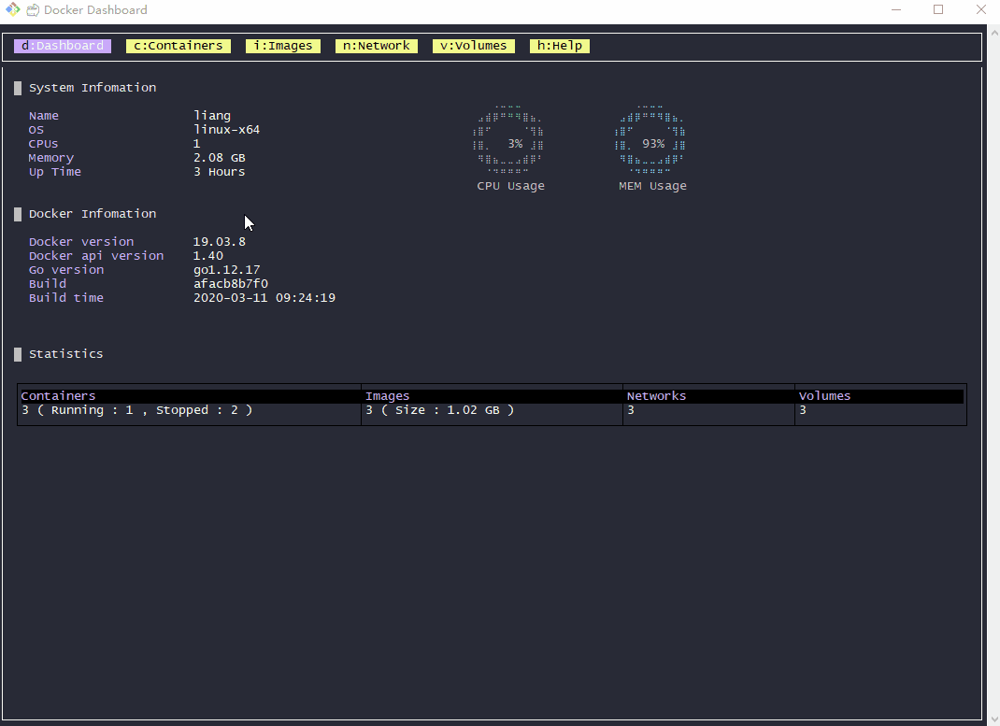

## Docker Dashboard [](https://www.npmjs.com/package/docker-dashboard) [](https://travis-ci.org/pipiliang/docker-dashboard) 

:computer::chart_with_upwards_trend:Console based docker dashboard, base on [blessed](https://github.com/chjj/blessed) and [blessed-contrib](https://github.com/yaronn/blessed-contrib).



## Install

```
$ npm install -g docker-dashboard
```
>Note: need to install the docker before use, and only support `unix socket`.

In the following environment test passed:

|OS|Docker|Nodejs|
|----|----|----|
|Ubuntu 16.04 LTS|v1.12.6|v8.10.0|
|Fedora 25|v1.12.6|v8.11.1|

**Other system and versions are not guaranteed.**

## Usage

```
$ docker-dashboard
```

## Shortcut
|shortcut|description|
|----|----|
|`D`| show node info, warm info and others.|
|`C`| show container list.|
|`I`| show image list.|
|`N`| show network list.|
|`V`| show volume list.|
|`H`| help.|
|`↑`| scroll up.|
|`↓`| scroll down.|
|`Enter`| select a container and show statistics.|
|`Q`| exit dashboard.|

> Support operation with mouse.

## Development

run with resource:
```shell
$ git clone git@github.com:pipiliang/docker-dashboard
$ cd docker-dashboard
$ npm i
$ npm run build
$ npm test
$ npm start
```


## Debug by VSCode

launch.json :
```json
{
    "version": "0.2.0",
    "configurations": [
        {
            "name": "Debug",
            "type": "node",
            "request": "launch",
            "args": [
                "${workspaceRoot}/src/index.ts"
            ],
            "runtimeArgs": [
                "--nolazy",
                "-r",
                "ts-node/register"
            ],
            "sourceMaps": true,
            "cwd": "${workspaceRoot}",
            "protocol": "inspector",
            "console": "integratedTerminal"
        }
    ]
}
```

## Thanks
- [blessed-contrib](https://github.com/yaronn/blessed-contrib)
- [blessed](https://github.com/chjj/blessed)
- [dockerode](https://github.com/apocas/dockerode)

## License
[](https://github.com/pipiliang/made/blob/master/LICENSE)
